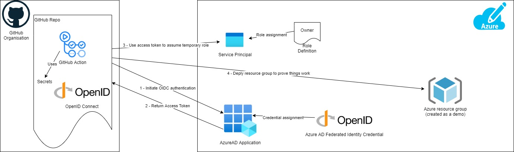

# azure-github-oidc

Repo using OIDC to authenticate to Azure from GitHub Actions

This repo will create Open ID Connect in Azure and link it to GitHub, along with a role assignment with permissions for GitHub to assume to provision resources.
This repo also includes a GitHub action which implements logging in with Open ID Connect, and then creates a resource group to provide it works

Instructions: -
  - Authenticate to Azure subscription you want to deploy to using your typical method (e.g. az login and set subscription with az account set --subscription <subscription_name>)
  - Run the folliwing commands
    - terraform init
    - terraform apply
      - enter the Azure AD tennat ID, github org and github repo you're deploying from
  - Add the following GitHub Secrets to your repository (within GitHub repo go to settings, secrets and create new secrets)
    - AZURE_CLIENT_ID - set to the output azure_client_id from the terraform code
    - AZURE_TENANT_ID - set to the azure_tenant_id from the terraform code
    - AZURE_SUBSCRIPTION_ID - set to the azure_subscription_id from the terraform code
  - Run the GitHub action that can now authenticate using OIDC
    - Navigate to GitHub actions and select 'Login to AWS using OIDC'
    - Select 'Run Workflow', set to branch you're working from and select 'Run workflow'
    - Navigate to GitHub action 'AWS using OIDC' and review the logs created by the runner

NOTE: -
 - To deploy from anything other than the main branch you need to alter the repository_branch_or_env variable from its default
 - The Azure Terraform provider doesn't support using az to login with Open ID connect at the present time - https://github.com/hashicorp/go-azure-helpers/issues/91

Please see my [blog article](https://markrosscloud.medium.com/using-open-id-connect-to-authenticate-to-azure-from-github-fc4240efbee5) for more information.